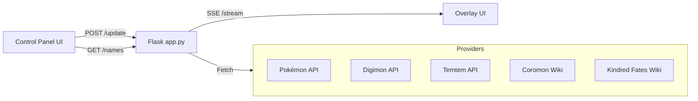

# 🎮 OBS Monster Encounter Counter (OMEC)

A web-based overlay and control panel for **OBS**, allowing you to display an encounter counter and a monster image (Pokémon, Digimon, Temtem, Coromon, Kindred Fates, etc.).  
Perfect for streaming **shiny hunts** or monster-catching games.

---

## ✨ Features

-   🔢 **Counter** with +1 / -1 / reset buttons
-   🎨 **Overlay** for OBS browser source (auto-updates via SSE)
-   🖼️ Fetches images/sprites from external **APIs**
-   🎭 **Shiny support** (Pokémon and other franchises with variants)
-   🧩 **Modular provider system** – easily add new franchises
-   📱 **Control panel** can be accessed from mobile or another device
-   📋 **Autocomplete** only shows names for the selected franchise

---

## 🚀 Getting Started

### 1. Clone the project

```bash
git clone https://github.com/djinnet/OMEC.git
cd OMEC
```

### 2. Install dependencies

```bash
pip install flask requests
```

### 3. Run the server

```bash
python app.py
```

### 4. Add overlay to OBS

-   Add a **Browser Source** in OBS
-   URL: `http://127.0.0.1:5000/overlay`
-   Suggested size: `800x600`

### 5. Open the control panel

-   Go to `http://127.0.0.1:5000/controls` in your browser
-   (On mobile, use your PC’s LAN IP instead of `127.0.0.1`)

---

## 🖼️ UI Examples

### Control Panel (controls.html)


-   Dropdown to select mode (Pokémon, Digimon, etc.)
-   Input with autocomplete for monster names
-   Buttons: `+1`, `-1`, `Reset`, `Toggle Shiny`
-   Dropdown for Pokémon generation selection

### Overlay (overlay.html)


-   Displays: Counter + Monster image
-   Updates in real-time when control panel changes state

---

## 🧩 Architecture

The system is built with **Flask (Python)** and **modular JavaScript providers**.  
Data flows between the control panel, server, and overlay as follows:



---

## 📂 Project Structure

```
obs-monster-counter/
│
├── app.py                  # Flask server + endpoints
├── static/
│   ├── script.js           # Main logic (SSE, counter, state sync)
│   ├── common.js           # Shared utilities
│   ├── images/            # Static images for readme
│   │   ├── controlsPage.png
│   │   └── overlayPage.png
│   ├── providers/          # Modular providers
│   │   ├── baseProvider.js
│   │   ├── pokemonProvider.js
│   │   ├── digimonProvider.js
│   │   ├── temtemProvider.js
│   │   ├── coromonProvider.js
│   │   └── kindredProvider.js
│   └── style.css           # Styling
├── templates/
│   ├── controls.html       # Control panel
│   └── overlay.html        # OBS overlay
│
└── README.md
```

---

## 🔧 Adding New Franchises

To add a new franchise:

1. Create a new provider inside `static/providers/`

    - Must export at least:
        - `mode` (unique string)
        - `label` (UI display name)
        - `enabled` (bool)
        - `validateName(name)`
        - `getSpriteUrl(name, shiny, generation)`

2. Import the provider in `script.js`
3. implement the names fetching in `app.py` (similar to existing providers)
4. Done ✅ – it will automatically appear in the mode dropdown and autocomplete

---

## 📸 Provider Examples

### Pokémon Provider

-   Fetches names from **PokeAPI**
-   Uses high-quality sprites from **Pokémon Home**
-   Supports shiny and generation selection

### Digimon Provider

-   Fetches names from **Digimon API**
-   Normal sprites only

### Temtem Provider

-   Fetches names from **Temtem API**
-   Uses wiki portrait images

---
